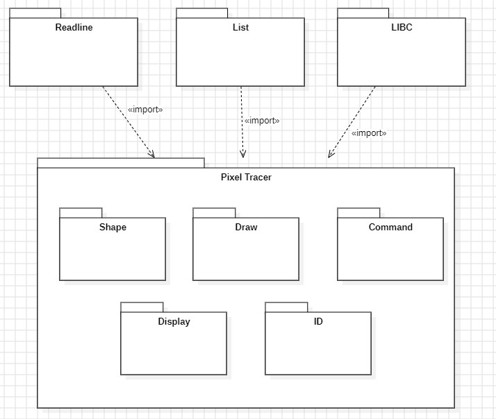
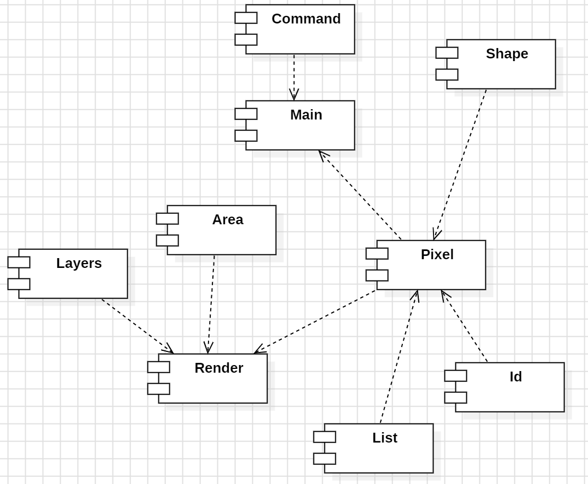
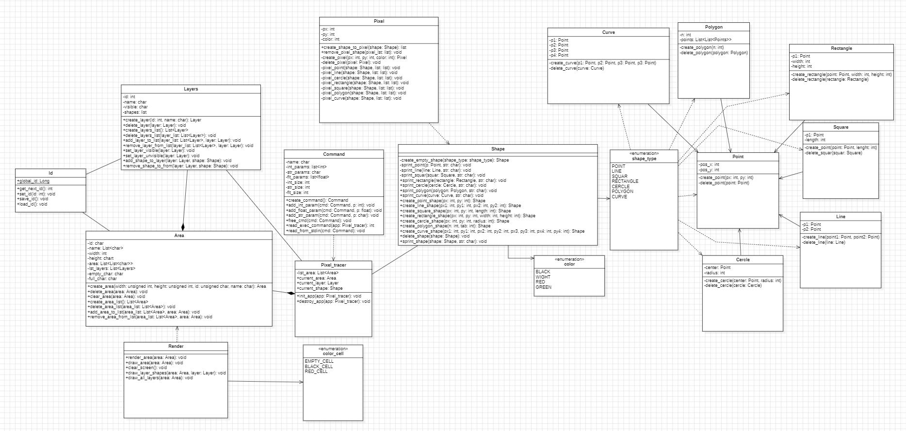
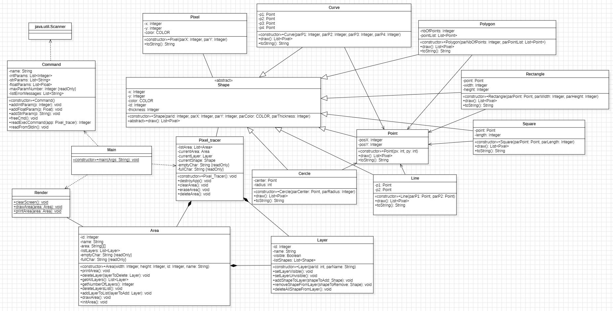

_Durand Antonin_  
_Jougla Maxime_  
_Parciany Benjamin_  
_Zehren William_

<h1 style="color:#5d79e7; text-align: center"> Dossier de conception : Pixel Tracer </h1>

<h1 style="color:#5d79e7; text-align: center; margin-top: 100px"> Table des matières</h1>

<ol>
    <li> <a href="#introduction"> Introduction  </a> </li>
    <li> <a href="#con_pt"> Conception de Pixel Tracer </a> </li>
    <ol>
        <li> <a href="#concepArchi"> Conception architecturale </a> </li>
        <ol>
            <li> <a href="#diagPackages"> Diagramme de packages </a> </li>
            <li> <a href="#diagComposants"> Diagramme de composants </a> </li>
        </ol>
        <li> <a href="#concepDeta"> Conception détaillée </a> </li>
        <ol>
            <li> <a href="#diagClassesC"> Diagramme de classes C</a> </li>
            <li> <a href="#diagClassesJava"> Diagramme de classes Java</a> </li>
        </ol>
    </ol>
</ol>

<h2 style="color:#5d79e7; page-break-before: always" id=introduction> Introduction </h2>

Ce document est un dossier de conception divisé en plusieurs parties. Il sera constitué de la conception architecturale et détaillée de Pixel Tracer. Il aura pour but de donner de renseigner toutes les informations sur la conception de l'application ainsi que des diagrammes permettant de la représenter graphiquement.

Pixel tracer est une application sur Linux et sur Windows, qui permet de réaliser des dessins vectoriels en ligne de commande sans interface graphique.

L'objectif du projet est d'effectuer du rétro-engineering sur le code C de Pixel Tracer pour définir des classes objet et donc passer l'application en Java. 

<h2 style="color:#5d79e7" id=con_pt> Conception de Pixel Tracer </h2>

Ce dossier de conception plus léger ne servira qu'a présenter les différents diagrammes représentatifs de la structure de l'application Pixel Tracer.

<h3 style="color:#5d79e7" id=concepArchi> Conception architecturale </h3>

Les diagrammes présentés dans cette section seront les suivants : 

- **Diagramme de packages** 
- **Diagramme de composants**

<h4 style="color:#5d79e7" id=diagPackages> Diagramme de packages </h4>

Un **diagramme de package** permet de représenter l'organisation et la structure d'une application, en modélisant les éléments qui la composent à travers des packages. 

Un package représente un regroupement d'éléments de l'application, il contient donc potentiellement des éléments de l'application de différents types et peut éventuellement contenir d'autres packages pour modéliser une hiérarchie entre ces derniers. 

Des relations de dépendances sont en général utilisées pour représenter les relations qu'ont un ou plusieurs packages entre eux. 

L'objectif premier d'un diagramme de packages est de représenter de manière simple et lisible les différentes fonctionnalités d'une application en regroupant les fichiers en fonctionnalités. 

 Diagramme de package de Pixel Tracer 

Le diagramme de packages de Pixel Tracer contient plusieurs packages principaux, chacun correspondant à des fonctionnalités :  

- Readline 
- List
- LIBC
- Pixel Tracer (Shape, Draw, Command, Display, ID héritent du package Pixel Tracer)

En Java, certaines de ces fonctionnalités ne seront plus présentes car pas utiles. Dans notre cas, seul le package ID ne sera pas présent. 

<h4 style="color:#5d79e7" id=diagComposants> Diagramme de composants </h4>

Un **diagramme de composants** permet de représenter les différentes fonctionnalités d'une application à travers des composants.

Un composant représente une fonctionnalité de l'application. On peut ensuite représenter les relations qu'ont les différents composants (et donc les différents fonctionnalités) entre eux à l'aide de dépendances. 

L'objectif premier d'un diagramme de composants est de représenter de manière détaillée et plus complexe les différentes fonctionnalités d'une application en créant un composant par fonctionnalité.

 Diagramme de composants de Pixel Tracer 

On retrouve donc dans ce diagramme, les fonctionnalités suivantes de l'application : 
- Command
- Main 
- Shape
- Pixel 
- Area
- Layers 
- Render
- List 
- Id

En Java, certaines de ces fonctionnalités ne seront plus présentes car pas utiles. Dans notre cas, seul le composant ID ne sera pas présent. 

<h3 style="color:#5d79e7" id=concepDeta> Conception détaillée </h3>

Les diagrammes présentés dans cette section seront les suivants : 

- **Diagramme de classes C** 
- **Diagramme de classes Java**

<h4 style="color:#5d79e7" id=diagClassesC> Diagramme de classes C</h4>

Un **diagramme de classes** permet de représenter l'organisation et la structure d'une application, en modélisant les différentes classes qui la composent ainsi que leurs attributs et leurs méthodes.

Dans notre cas, on réalise en premier lieu un diagramme de classes pour le code C de l'application.

 Diagramme de classes C de Pixel Tracer 

<h4 style="color:#5d79e7" id=diagClassesJava> Diagramme de classes Java</h4>

En étudiant le diagramme de classes du code C, on peut établir un diagramme de classe en Java qui nous permettra de définir nos classes dans le code Java de l'application. 

 Diagramme de classes Java de Pixel Tracer 

